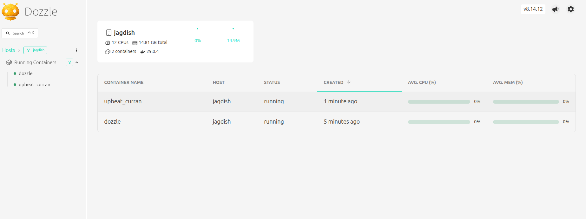

### setup dozzle

(1) $ docker pull amir20/dozzle:latest
```bash
latest: Pulling from amir20/dozzle
729de67e45d0: Pull complete 
c2fcfae87f2f: Pull complete 
afe219c4758f: Pull complete 
e519b76d96e0: Pull complete 
Digest: sha256:0df89c904da71e94a0c9ed3c89a890f01488321b5f10ac1e0c0bedcead9af6e4
Status: Downloaded newer image for amir20/dozzle:latest
docker.io/amir20/dozzle:latest
```

(2) $ docker run -d \
  --name dozzle \
  -p 8080:8080 \
  -v /var/run/docker.sock:/var/run/docker.sock \
  amir20/dozzle:latest
b68d5d1ff38b545a1c93d1f4ceb7c46f5f5b1774d71edf73f33ea4db0b3aad36

(3) now to view any container logs, from browser
`http://localhost:8080/`

(4) Attached screenshot
